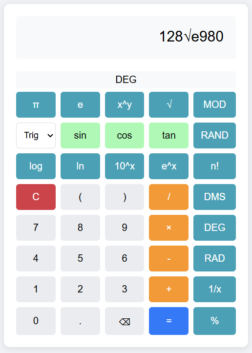
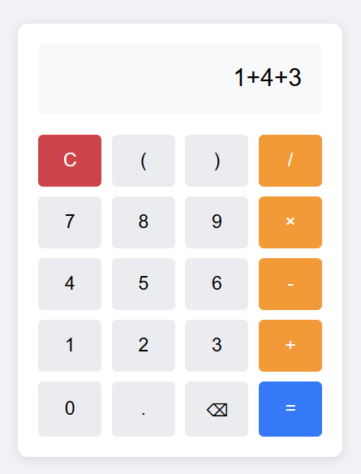

# Calculator

A simple and scientific calculator built using Java with a user-friendly interface. This project provides basic arithmetic operations and advanced scientific functions.

## Features

- **Simple Calculator**: Supports basic arithmetic operations like addition, subtraction, multiplication, and division.
- **Scientific Calculator**: Includes trigonometric functions, logarithms, exponentiation, and more.
- **User-Friendly UI**: Easy-to-use graphical interface.

## Screenshots

### Scientific Calculator


### Simple Calculator


## Installation & Usage

1. Clone the repository:
   ```sh
   git clone https://github.com/yourusername/Calculator.git
   ```
2. Open the project in your preferred Java IDE (e.g., IntelliJ IDEA, Eclipse, or NetBeans).
3. Build and run the application.

## Technologies Used

- **JS** - Core language used.

## Contributing

Contributions are welcome! Feel free to fork the repo and submit pull requests.
